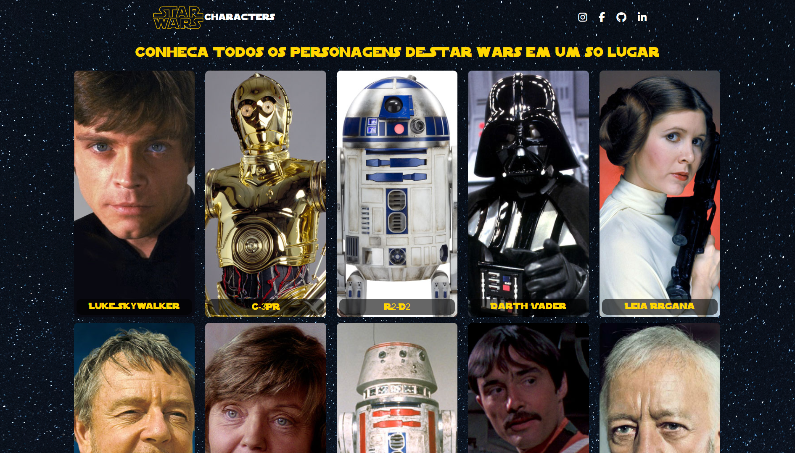

<h1 align="center">Star Wars Characters</h1>

Este é um projeto aberto. Confira a seguir informações relevantes sobre ele. 

  <a href="#-tecnologias">Tecnologias</a>&nbsp;&nbsp;&nbsp;|&nbsp;&nbsp;&nbsp;
  <a href="#-projeto">Projeto</a>&nbsp;&nbsp;&nbsp;|&nbsp;&nbsp;&nbsp;
  <a href="#-instruções">Instruções</a>&nbsp;&nbsp;&nbsp;|&nbsp;&nbsp;&nbsp;
  <a href="#memo-licença">Licença</a>

  

 

  

## 🚀 Tecnologias

Esse projeto foi desenvolvido com as seguintes tecnologias:

- JavaScript
- HTML
- CSS

## 💻 Projeto

Esse projeto traz várias informações sobre os personagens da franquia Star Wars. Essa aplicação possui uma paginação onde é possível navegar em meio a mais de 80 personagens. Ao clicar em um personagem, é aberto um modal com maiores informações sobre ele. Todas essas informações estão sendo obtidas através da API [Swapi](https://swapi.dev/). Foram colocados em prática consumo de API e manipulação de  elementos através de Javascript. 

- [Acesse o projeto finalizado, online](https://rodrigoserrasqueiro.github.io/Star-Wars-Characters)

## 📝 Instruções

### Clonando o repositório

Abra o terminal do seu sistema operacional e navegue até o diretório onde deseja clonar o repositório.

Digite o seguinte comando para clonar o repositório:

`git clone https://github.com/RodrigoSerrasqueiro/Star-Wars-Characters.git`

### Executando o projeto

Na pasta do projeto, digite o seguinte comando para iniciar o servidor de desenvolvimento:

`npm start`

## Conclusão:

Pronto! Agora você pode clonar e executar o projeto em sua máquina. Caso tenha alguma dúvida ou problema, sinta-se à vontade para abrir uma issue em nosso repositório.

## :memo: Licença

Esse projeto está sob a licença MIT.

---

Desenvolvido por: Rodrigo Serrasqueiro [Dê uma olhada no meu portfólio!](https://rodrigoserrasqueiro.github.io/Portfolio)